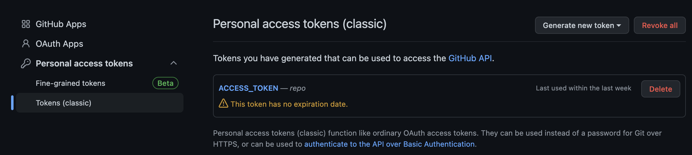
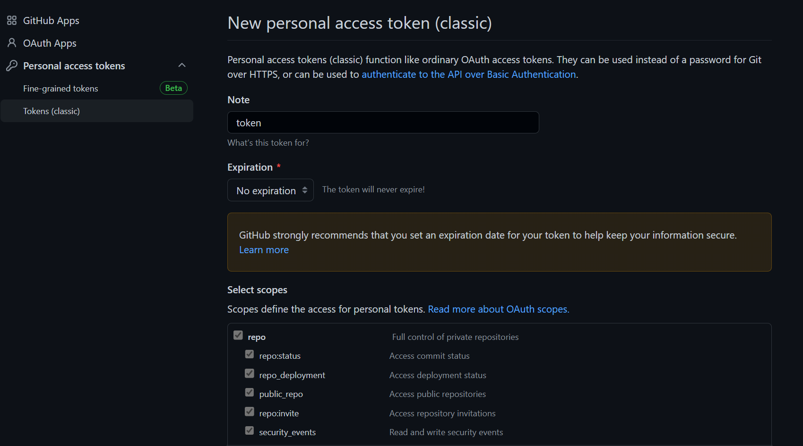
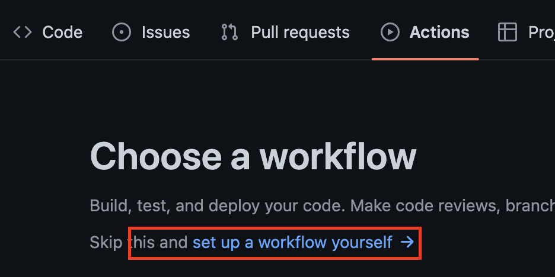
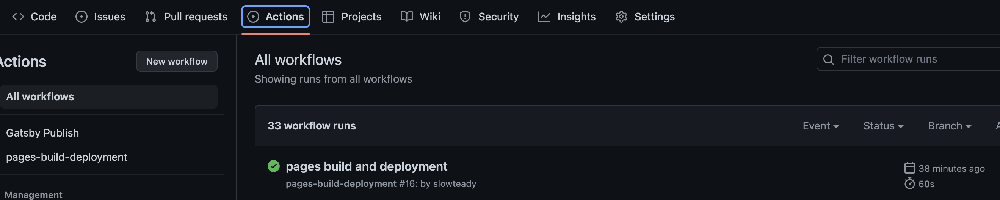

최근에 개발 블로그의 필요성을 느꼈다.

리액트 공부를 시작하면서 머릿속에 새로운 개념들이 마구잡이로 주입되는데, 개념이 정립되지 않았다.

개념의 정확한 이해를 위해 내용을 정리하면서 진행해야겠다는 생각이 들었고, 블로그를 해야겠다는 생각이 들었다.

괜히 개발자 선배님들이 블로그를 하는 게 아니구나 하는 생각이 들었다.

***

## 1. Github Pages & Gatsby

정말 많은 블로그 플랫폼이 있다. 노션, 티스토리, 벨로그 등등

취향껏 고를 수 있게 각각 특색이 있었다.

그중에 내가 고른 플랫폼은 깃헙 블로그이다.

정해진 범위 내에서의 커스텀이 아닌 전체를 커스텀 할 수 있다는 점, 소스를 표현하기 쉽다는 점이 매력적이었다.

깃헙 페이지스에서 호스팅 서비스를 제공하기 때문에 구축이 어렵지 않았다. 😀

깃헙 페이지스가 호스팅 서비스를 제공하니 페이지 파일들을 만들어주면 되는데, 정적 사이트 생성기를 이용하면 보다 편하게 파일을 생성할 수 있다.

대표적으로 Jekyll과 Gatsby가 있다.

지킬은 Ruby를 기반으로 동작하고, 개츠비는 React와 GraphQL를 기반으로 동작한다.

학습중인 리액트를 사용할 기회도 있고 나중에는 나만의 디자인으로 이루어진 블로그를 만들어보고 싶어서 개츠비를 선택했다.

*** 

## 2. 설치
### 2-1. Template 생성
이미 다양한 템플릿들이 패키지로 많이 나와있고 빠르고 간단하게 사용하고 싶었기 때문에 템플릿을 이용했다. 

[줌코딩](https://github.com/zoomkoding/zoomkoding-gatsby-blog)님의 템플릿이 마음에 들어서 사용했다.   

> 🙋🏻‍♂️ 오래된 템플릿 사용 시, package.json의 dependency끼리 충돌이 일어나 오류가 생길 수 있다.   
이 경우, 버전을 하나씩 맞춰가면서 수정해주거나 npm의 --force 옵션 등을 이용하여 해결해야한다.

다른 스타일의 템플릿을 원한다면 [Gatsby Starters](https://www.gatsbyjs.com/starters)를 이용하면 된다.

ㅇ **템플릿 설치**
```bash
npm install gatsby-cli
gatsby new blog-start https://github.com/zoomkoding/zoomkoding-gatsby-blog
```

ㅇ **npm start**
```bash
cd blog-start
npm start
```

### 2-2. Repository 생성
**${github_id}.github.io**  의 형태로 레포지토리를 생성한다.


### 2-3. git push
내 레파지토리에 push를 해준다.
```bash
git add .
git commit -m "blog start"
git remote add origin https://github.com/${github_id}/${repository_name}.git
git push -u origin main
```
***

## 3. 배포
깃헙 페이지스로 바로 deploy 시키면 컴파일된 파일들로 덮어 씌워지기 때문에 branch를 만들어야한다.

ㅇ **gh-pages 설치**
```bash
npm install gh-pages --save-dev
```

ㅇ **package.json에 script 추가** 
```json
{
  "scripts": {
    "deploy": "gatsby build && gh-pages -d public" 
  }
}
```
ㅇ **명령 실행**
```bash
npm run deploy
```
를 사용하여 배포할 수 있다.

## 4. 배포 자동화
npm run deploy 명령어를 통해 배포할 수 있지만
수정 할 때 마다 명령을 실행해주기에는 은근히 귀찮고 번거롭다.

Github Action을 통하여 배포 자동화를 해주면, 커밋 할 때 마다 자동으로 배포가 된다.

**settings > Developer settings > Tokens** 메뉴로 간다.



**Generate new token > repo** 부분을 체크 후 토큰을 생성하고 token value를 복사하여 저장한다.
> 🙋🏻‍♂️ token value는 재발급이 안되기 떄문에 꼭 복사해야한다!!



**블로그 repository > settings > secrets and variables > Action** 메뉴에서
**New repository secret**을 클릭, 변수로 사용할 이름을 지정하고 token value를 내용으로 추가하여
secrets을 추가시켜준다.



**블로그 repository > Actions**로 이동하여 **set up a workflow yourself**를 클릭한다.


main.yml 이름으로 생성하고, 트리거를 실행할 branch를 선택한다.

```bash
name: Gatsby Publish
on:
  push:
    branches:
      - main
jobs:
  build_gatsby:
    name: deploy
    runs-on: ubuntu-latest
    steps:
      - uses: actions/checkout@v1
      - uses: actions/setup-node@v3
        with:
          node-version: '18.x'
      - uses: enriikke/gatsby-gh-pages-action@v2
        with:
          access-token: ${{ secrets.ACCESS_TOKEN }}
          deploy-branch: gh-pages
```
위와 같은 형식으로 설정 해주면되고

secrets.ACCESS_TOKEN은 설정한 secrets 변수 이름과 맞춰주면 된다.



git push후 정상적으로 동작하는지 확인한다.

***


```toc

```