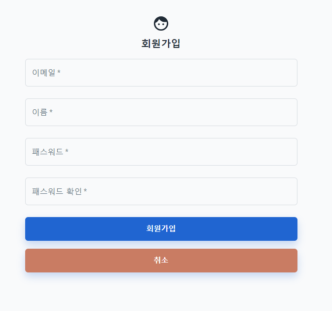

## ✔ 팝콘 프로젝트

나는 다양한 문화생활을 좋아하지만 특히 영화를 애정한다.  
학생 시절엔 영화 기자라는 직업에 관심이 있었고 하루에 한편 이상의 영화를 보는 것이 일과이고 낙이었을 정도였다.  
그래서 지금도 여전히 영화 관련 컨텐츠에 항상 관심을 가지고있다.  
개발 세상에 들어올 때, 영화 관련 웹사이트를 만들어 서비스를 해보고 싶다는 생각을 계속 해왔고 이번 사이드 프로젝트의 주제로 선정을 하게 되었다.

---

### 1. 사이드 프로젝트

재직중인 회사에서 풀스택으로 일을 해왔고 어떤 포지션이 나에게 더 적합한지 생각을 해왔다.  
내 소스가 화면으로 즉각적으로 표현되면서 UI/UX와 디자인에 대해서도 고민할 수 있는 프론트엔드를 좋아하게 되었다.  
그래서 자연스레 프론트엔드로 커리어를 전환하고 싶다는 생각이 들었다.  
자바스크립트, 리액트, 타입스크립트 공부를 진행했고 학습한 것들을 적용하면서 경험을 쌓을 사이드 프로젝트의 필요성을 느꼈다.  
그래서 영화를 주제로 한 팝콘 프로젝트를 시작하게 되었다.

---

### 2. 기술 스택

ㅇ Node.js, Express  
ㅇ Mongoose  
ㅇ React.js, React-Router-Dom, Recoil, React Query  
ㅇ TypeScript  
ㅇ Material-UI  
ㅇ Webpack  
ㅇ Yarn berry

재직중이기 때문에 프로젝트를 진행할 수 있는 시간이 일정하지 않아 스케줄 맞는 사람과의 협업은 어렵다는 생각이 들어 혼자서 풀스택으로 진행하기로 결정했다.  
먼저 백엔드 언어를 선택해야 했는데, 재직중에 자바스크립트를 통해 서버 구축을 할 수 있다는 것이 신기하고 궁금해서 Node.js와 Express를 학습한 적이 있었다.  
다양한 라이브러리를 통해 간단한 서버를 빠르게 구축 할 수 있다는 장점이 있어 Node.js를 선택하게 되었다.  
DB는 Express와 궁합이 잘 맞기도 하고 NoSQL을 경험하고 싶어 MongoDB를 선택하게 되었다.  
그리고 사이드 프로젝트 진행의 이유인 리액트와 타입스크립트, 리액트의 state 관리를 위한 서드파티로 Recoil, API 호출 성능 향상을 위해 React Query를 선택했다.  
마지막으로 디자인을 위해 MUI를 선택했고 번들링 빌드 도구로 Webpack, 패키지 관리 도구로 yarn을 선택했다.

---

### 3. 1주차 회고

1주차 목표는 프로젝트 기본 구성과 로그인/로그아웃/회원가입 기능이었다.  
내 예상보다 더 어려웠고 시간 투자를 많이 한 것 같다.

#### ① 프로젝트 기본 구성

Node.js와 React.ts의 환경 구성을 해보는 것이 처음이라 꽤나 헤맸던 것 같다.  
env파일의 관리 방법부터 webpack의 설정 방법, 로직의 파일 분기처리 유무 등 어떤 방법이 더 효율적이고 직관적일지에 대해 고민을 많이 했던 것 같다.  
웹팩 설정을 하면서 예상치 못하게 시간 투자를 꽤 많이 하게 되었었다.  
대규모 프로젝트의 설정이 아님에도 불구하고 설정 방법이나 모듈에 맞는 웹팩 설정 사용법 등이 있어 어려움에 직면 했지만 AI 도구들과 구글링의 도움을 받아 하나하나 설정 해보았고 진전이 생기니 나름 재미도 느껴졌다.  
그리고 웹팩이 정말 좋은 도구라는 것도 다시 생각해보게 되었다.

#### ② 회원가입

클라이언트에서 유효성 검사 로직을 구현하는 것이 생각보다 까다로웠다.  
각각 input 요소마다 정규식을 통해 검증하는 로직을 만들었다.  
구현을 하면서 문제에 직면하거나 문제 발생의 여지가 있는 부분들에 대해 생각하면서 구현을 했는데, 개발 이전에 어느 정도 설계를 했으면 좀 더 효율적으로 수월하게 개발을 했을 것 같다는 아쉬움이 남았다.

#### ③ 로그인/로그아웃

유저 검증을 위해 JWT 토큰을 사용했고 쿠키에 담아 사용하는 방식으로 구현했다.  
기억하기 기능은 로컬 스토리지를 통해 구현했다.  
비교적 간단하게 구현했지만, 구현 하면서 로그인 기능도 설계에 따라 규모와 난이도가 천차만별로 달라질 수 있다는 것을 느꼈다.

---
