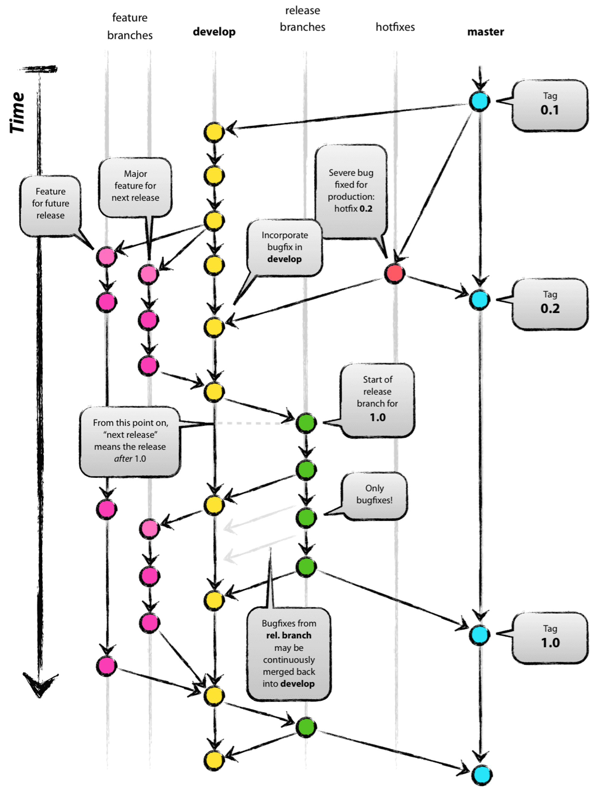

출처: (<https://nvie.com/posts/a-successful-git-branching-model/>)

## ✔ Git-flow

### Git-flow 란?

Git-flow는 대중적으로 많이 사용되는 개발 작업 절차이자 방법론 중 하나이다.  
Git-flow 방식을 사용할 경우, 체계적이고 효율적으로 프로젝트를 관리할 수 있다.  
브랜치를 이용한 프로젝트 관리 방식이다.

### Branch

Git-flow에서 사용되는 대표적인 브랜치는 아래와 같다.  

- main: 프로덕트로 배포할 수 있는 브랜치
- develop: 프로덕트가 되기 전의 개발 버전을 다루는 브랜치
- feature: 단위별로 기능을 개발하는 브랜치
- release: main 브랜치로 병합 전에 QA를 통해 버그를 찾아내기 위한 브랜치
- hotfixes: 버그가 발생했을 경우, 빠르게 버그를 수정하기 위한 브랜치

### 순서

1. main 브랜치와 develop 브랜치로 시작한다.  
2. feature 브랜치를 생성하여 기능을 개발하고 develop 브랜치에 병합한다.  
3. 이번 버전에 필요한 기능이 모두 개발 되었다면 QA를 위해 release 브랜치를 생성한다.  
4. release 브랜치에서 QA 진행 후 develop 브랜치와 main 브랜치에 병합한다.
5. main 브랜치에서 버그 발생 시 hotfixes 브랜치를 생성하여 버그 수정 후 main, develop 브랜치에 병합한다.

> **브랜치와 순서는 절대적이지 않다.  
> 팀원들과의 소통을 통해 유연하게 컨벤션을 맞추는 것이 옳은 방향이다.**

---
📂 **참고자료**  

- [chanyeong님 블로그](https://chanyeong.com/blog/post/15)
