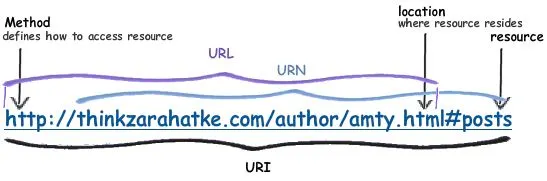

## ✔ 네트워크 기초

### 1. 인터넷 네트워크

**① IP(인터넷 프로토콜)**

ㅇ IP 주소를 통해 패킷이라는 통신 단위로 데이터를 전달한다.  
ㅇ IP는 대상을 쉽게 분별할 수 있다는 장점이 있다.  
ㅇ 패킷을 받을 대상의 상태와 관계없이 패킷을 전송하거나, 패킷이 유실되어도 알 수 없다는 점 등의 단점이 있다.

**② TCP 프로토콜**

ㅇ IP 패킷 안에 들어가 있고 PORT, 전송제어, 순서 등의 정보를 가지고 있어 IP의 단점을 보완해준다.  
ㅇ TCP는 전송제어 프로토콜이다.  
ㅇ TCP 3 way handshake 연결을 지향하고 데이터 전달을 보증한다.  
❓ 3 way handshake?
> 클라이언트-서버 통신 환경에서 클라이언트가 접속 요청 메세지를 서버에게 보내면 서버가 요청을 수락한다는 메세지와 함께 접속 요청 메세지를 보내고 클라이언트가 서버에게 데이터를 전송하게 되는데, 이 과정을 3 way handshake라고 한다.

**③ UDP 프로토콜**

ㅇ 단순하고 빠르다는 장점이 있다.  
ㅇ 데이터 전달 보증과 순서 보장이 되지 않는다는 단점이 있다.  

**④ PORT**

ㅇ 같은 IP 내에서 프로세스를 구분할 때 사용한다.

**⑤ DNS**

ㅇ 도메인 네임 시스템(Domain Name System)의 줄임말이다.  
ㅇ IP를 사람이 기억하기 쉬운 이름으로 도메인 명을 IP 주소로 변환한다.

---

### 2. URL

**① URI**  
ㅇ URI(Resource Identifier)는 URL(Resource Locator)와 URN(Resource Name)을 포함하는 단어다.

**② URL**  
ㅇ 리소스가 있는 위치를 지정한다.  
ㅇ 주로 프로토콜을 사용하는데, http, https, ftp 등이 있다.  
ㅇ #뒤에 오는 리소스를 Fragment라고 부른다.  
❓ Fragment?
> html 내부 북마크 등에 사용되고 서버에 전송하는 정보가 아니다.

**③ URN**  
ㅇ 리소스에 이름을 부여한다.  
ㅇ URN 이름으로 실제 리소스를 찾을 수 있는 방법이 보편화 되어있지 않다.

---

📂 **참고자료**

- [김영한님 http 강의](https://www.inflearn.com/course/http-%EC%9B%B9-%EB%84%A4%ED%8A%B8%EC%9B%8C%ED%81%AC)
