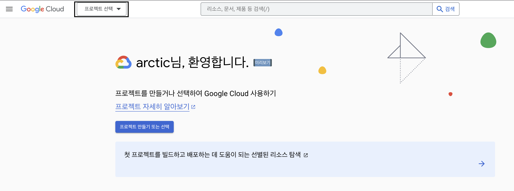
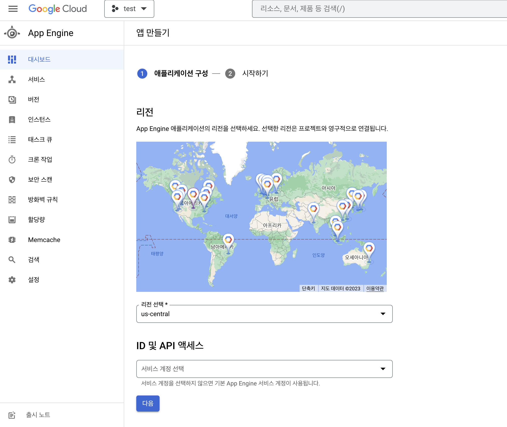
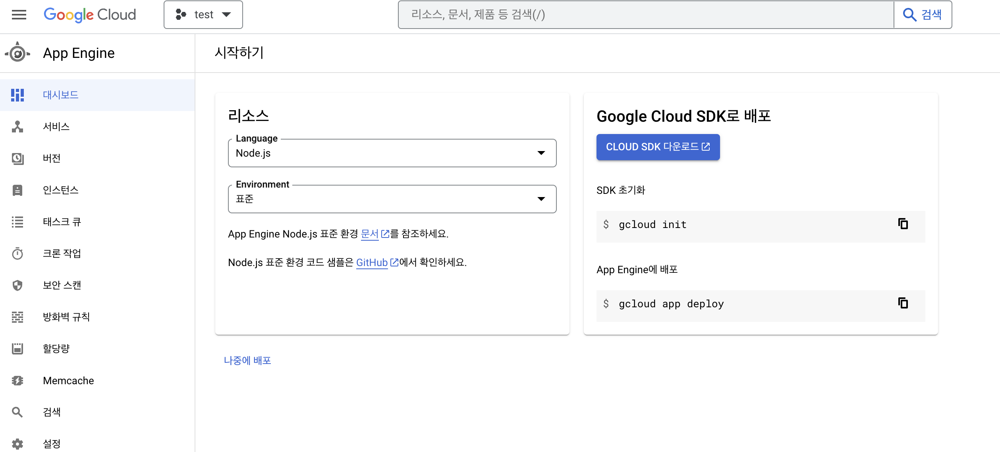

## ✔ 구글 클라우드(Google Cloud Platform)

## 구글 클라우드 배포

GCP에서는 Paas 서비스인 App Engine과 Iaas 서비스인 Compute Engine을 이용하여 배포를 할 수 있다.  

### 1. App Engine

> 웹서버를 배포하기 적합하고 app.yaml 파일을 이용하여 배포 환경을 핸들링 할 수 있다.

#### 1-1. 프로젝트 생성



로그인 후 프로젝트를 생성한다.

#### 1-2. 앱 만들기



App Engine 메뉴에서 애플리케이션을 생성한다.  
리전은 한국 서버인 asia-northeast3를 선택한다.

#### 1-3. Google Cloud SDK 설치 및 gcloud 사용



Google Colud SDK 다운로드 후 터미널을 통해 배포할 프로젝트의 디렉토리에서 Configuration을 설정한다.  

```bash
> gcloud init

Welcome! This command will take you through the configuration of gcloud.

Settings from your current configuration [기존 프로젝트] are:
core:
  account: vbn0213@gmail.com
  disable_usage_reporting: 'False'
  project: 기존 프로젝트

Pick configuration to use:
 [1] Re-initialize this configuration [기존 프로젝트] with new settings 
 [2] Create a new configuration
 [3] Switch to and re-initialize existing configuration: [default]
 [4] Switch to and re-initialize existing configuration: [기존 프로젝트]
Please enter your numeric choice:  2 # configuration 생성

Enter configuration name. Names start with a lower case letter and contain only lower case letters a-z, digits 0-9, and hyphens '-':  test # configuration 이름 지정
Your current configuration has been set to: [test]

You can skip diagnostics next time by using the following flag:
  gcloud init --skip-diagnostics

Network diagnostic detects and fixes local network connection issues.
Checking network connection...done.                                                                                                                                                                                
Reachability Check passed.
Network diagnostic passed (1/1 checks passed).

Choose the account you would like to use to perform operations for this configuration:
 [1] vbn0213@gmail.com
 [2] Log in with a new account
Please enter your numeric choice:  1 # 이메일 선택

You are logged in as: [vbn0213@gmail.com]

Pick cloud project to use: 
 [1] 프로젝트1-ID
 [2] 프로젝트2-ID
 [3] 프로젝트3-ID
 [4] 프로젝트4-ID
 [5] 프로젝트5-ID
 [6] Enter a project ID
 [7] Create a new project
Please enter numeric choice or text value (must exactly match list item):  6
# 생성 되어있는 프로젝트를 선택하거나 아래와 같이 ID를 직접 입력해도 된다.
# ID는 프로젝트 선택 모달 팝업을 통해 쉽게 확인 가능

Enter project ID you would like to use:  프로젝트-ID
Your current project has been set to: [프로젝트-ID].
...

```

기존 프로젝트가 있을 경우 위 처럼 출력되는데, 배포할 프로젝트의 환경을 만들어주면 된다.  

```yaml
# app.yaml
# create-react-app으로 생성한 프로젝트 예시
# 빌드 했을 때의 디렉토리가 build이므로 아래와 같이 설정

runtime: nodejs16
env: standard

handlers:
  - url: /static
    static_dir: build/static

  - url: /(.*\.(json|ico))$
    static_files: build/\1
    upload: build/.*\.(json|ico)$

  - url: /
    static_files: build/index.html
    upload: build/index.html

  - url: /.*
    static_files: build/index.html
    upload: build/index.html

automatic_scaling:
  target_cpu_utilization: 0.65
  min_instances: 1
  max_instances: 5
```

프로젝트의 루트 디렉토리에 app.yaml 파일을 생성하여 위와 같이 배포 환경에 대한 설정을 한다.  

```bash
> gcloud app deploy

Services to deploy: ... 

# 설정이 맞으면 Y
Do you want to continue (Y/n)?  Y

Beginning deployment of service [default]...
╔════════════════════════════════════════════════════════════╗
╠═ Uploading 26 files to Google Cloud Storage               ═╣
╚════════════════════════════════════════════════════════════╝
File upload done.
Updating service [default]...⠼ 

```

gcloud app deploy 명령어를 통해 배포를 진행하고 배포가 완료될 때 까지 기다린다.  
배포 완료 후, gcloud app browse 명령어로 배포된 것을 확인할 수 있다.

---
