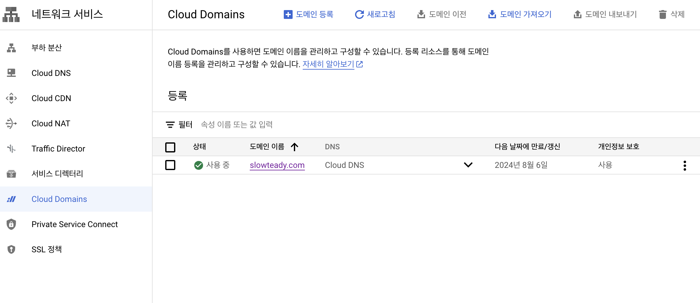
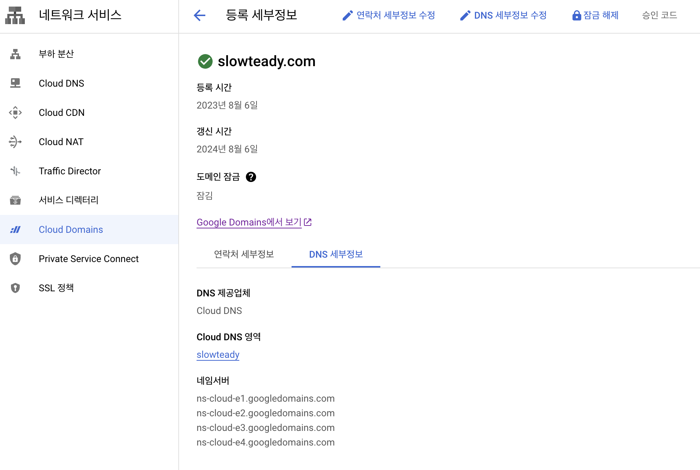
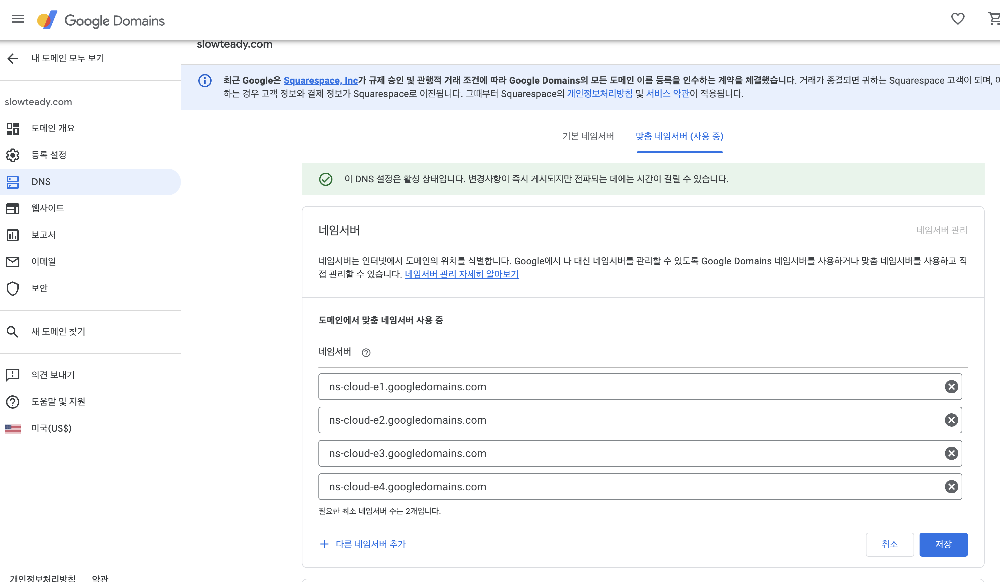
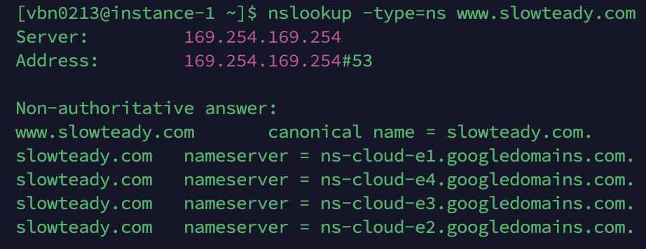
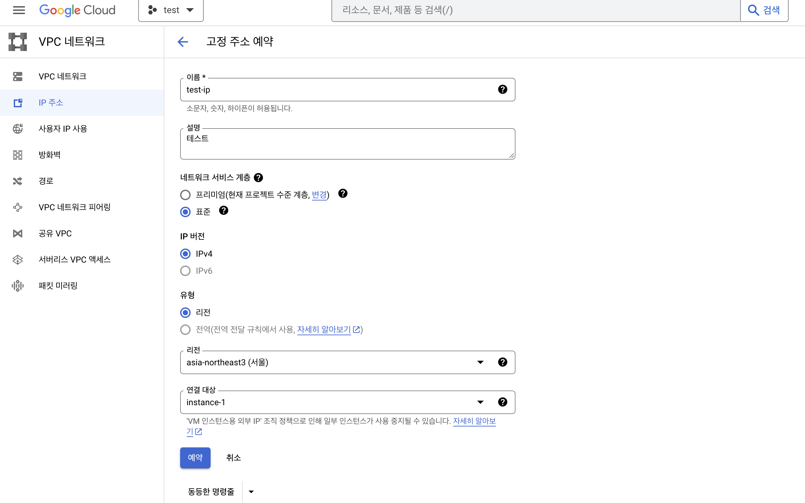
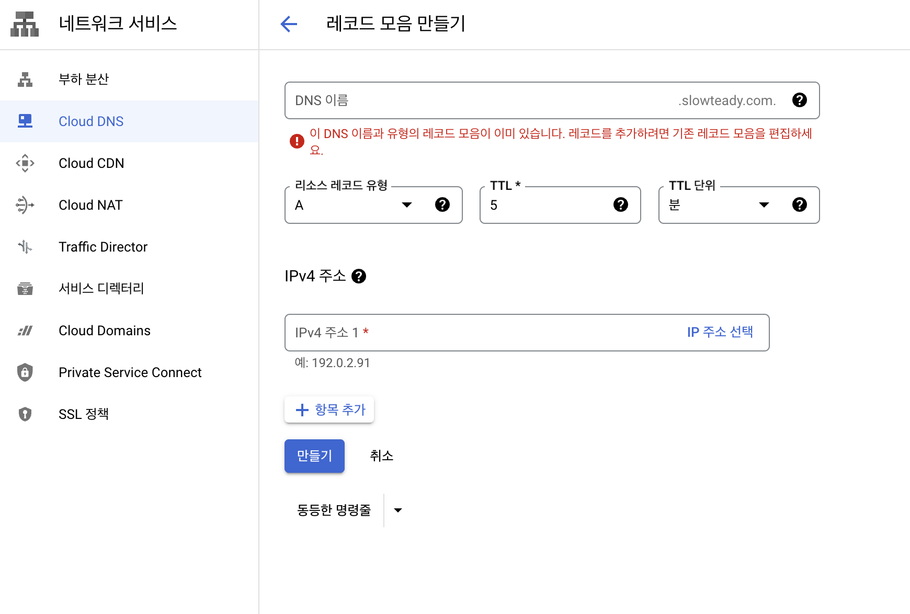
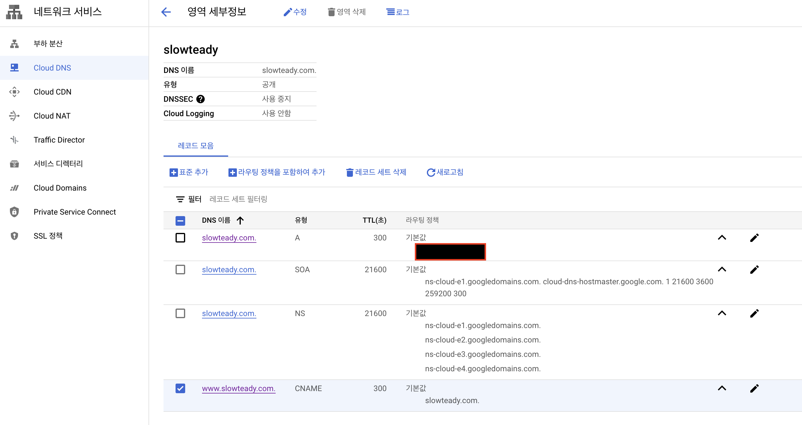
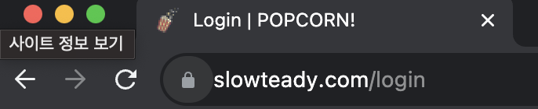

## ✔ 구글 클라우드(Google Cloud Platform)로 도메인 적용하기

### 1. 도메인 구입

도메인 구매 사이트에서 도메인을 구매한다.  
**[Google Domain](https://domains.google.com/)에서 구입하면 연동이 가능하다.**

### 2. 도메인 추가 및 네임서버 설정

네트워크 서비스 카테고리에서 구매한 도메인을 추가한다.  

도메인 세부 정보에서 네임버서 주소를 복사하여 구매한 플랫폼에 추가한다.

> 네임서버가 적용이 되었어도 실질적으로 처리가 되는데 시간이 꽤 오래 걸릴 수 있다.  
> nslookup -type=ns [도메인] 명령어를 통해 반영이 되었는지 확인할 수 있다.

### 3. 고정 IP 설정

임시로 되어 있던 외부 ip를 위와 같이 설정하여 고정 ip로 변경한다.

### 4. 도메인과 IP 연결

네트워크 서비스에서 레코드를 추가한다.  
A유형에 고정 IP를 추가, CNAME유형에 도메인을 추가하여 레코드 모음을 추가한다.

위와 같이 레코드 모음을 설정해준다.  

적용이 완료되었는지 확인한다.

---
