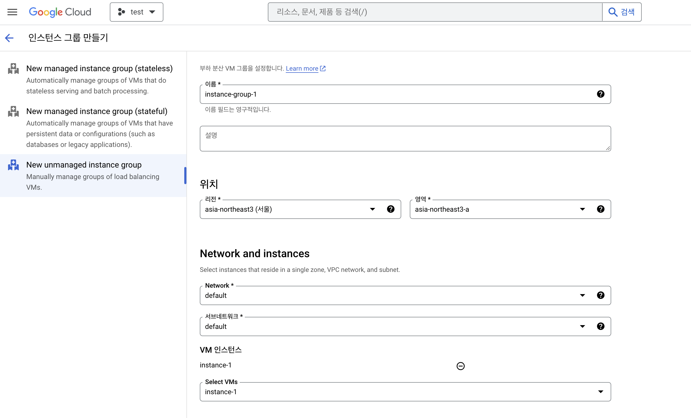
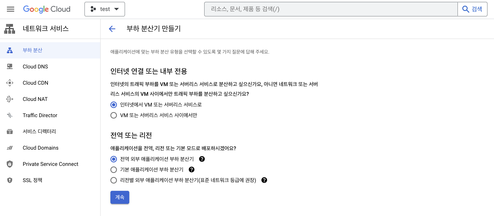
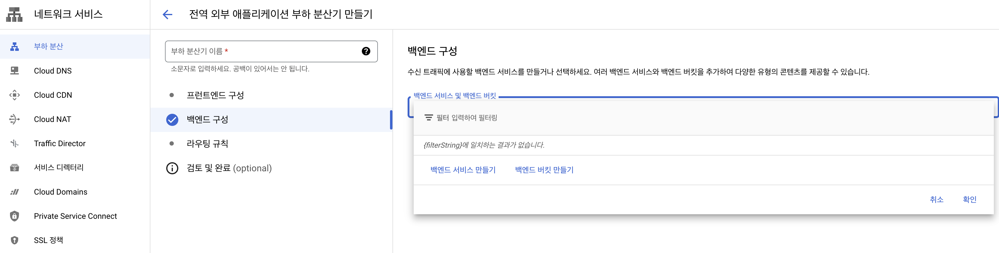
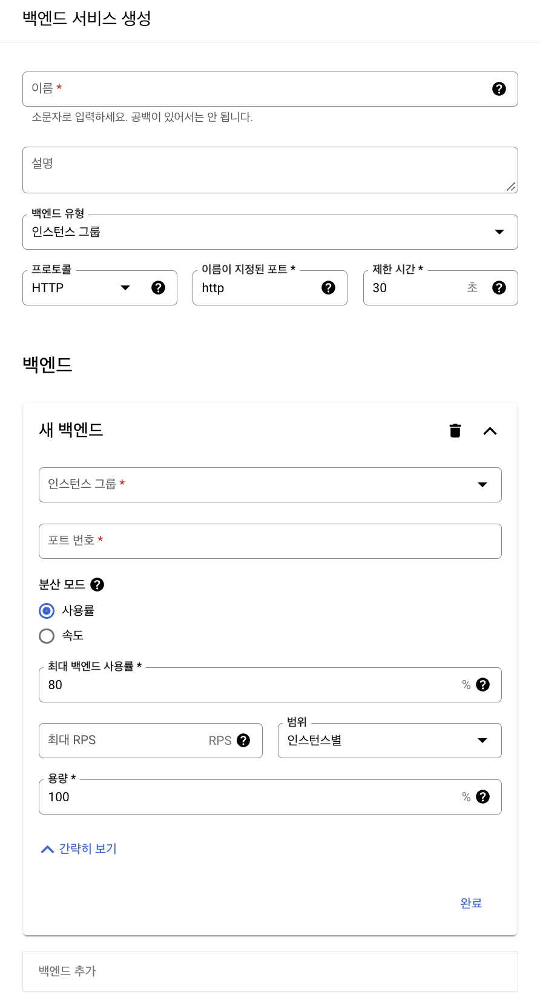
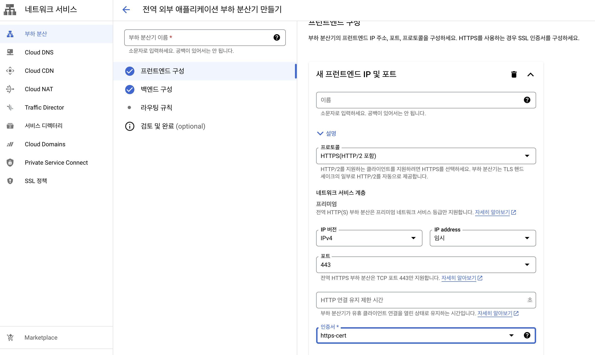
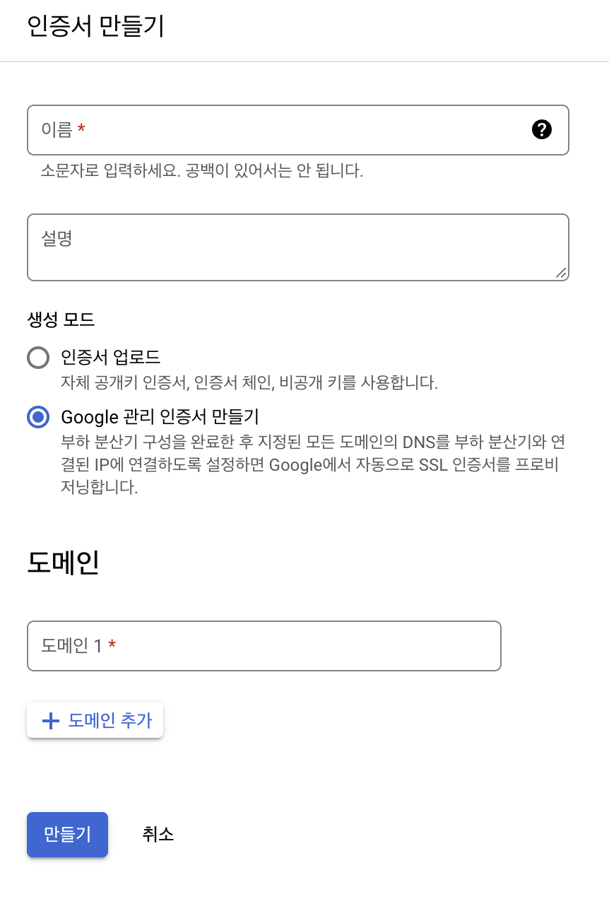
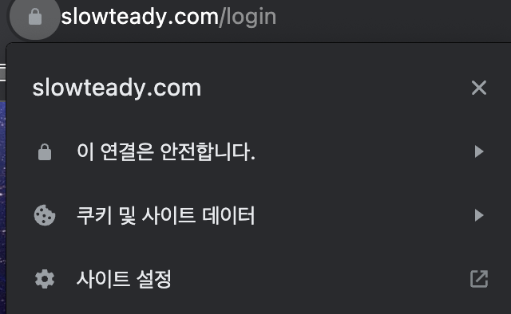

## ✔ 구글 클라우드(Google Cloud Platform)로 HTTPS 적용하기

### 1. 인스턴스 그룹 만들기

Compute Engine 메뉴 > 인스턴스 그룹 메뉴 >  인스턴스 그룹 만들기 버튼 클릭 > New unmanaged instance group 메뉴에서 위와 같이 생성한다.

### 2. 고정 IP 생성

고정 IP를 생성해야한다.  
[3. 고정 IP 설정 참고](https://slowteady.github.io/infra/gcp-02/)

### 3. 부하 분산기 생성

네트워크 서비스 메뉴 > 부하분산 메뉴로 이동하여 HTTPS로 부하 분산기를 생성한다.  
그리고 백엔드, 프론트엔드를 구성해야한다.  
백엔드, 프론트엔드 구성 후 부하 분산기 생성을 하면 HTTPS 적용까지 시간이 다소 소요된다.

#### 3-1. 백엔드 구성

위의 메뉴에서 백엔드 서비스 만들기를 클릭한다.  

이름 입력 후, 인스턴스 그룹에 생성했던 그룹을 넣는다.  
Cloud CDN의 상태 확인에는 기본값인 webrtc-healthcheck을 넣고 생성한다.

#### 3-2. 프론트엔드 구성

만들어놓은 고정 IP주소를 넣고 프로토콜을 HTTPS로 설정한다.  
인증서 만들기에서 만들어놓은 도메인을 넣어 인증서를 생성한다.

### 4. 확인

부하 분산기 생성 후 적용까지 시간이 많이 소요된다.  
기다렸다가 적용이 완료됐는지 확인한다.

---
