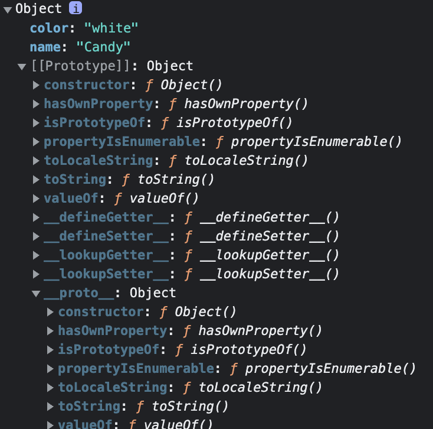

자바스크립트는 클래스 기반의 객체지향 언어와는 다르게 프로토타입 기반 객체지향 언어이다.  

## 프로토타입

자바스크립트의 모든 객체는 부모 객체와 연결되어 있다.  
그리고 부모 객체의 프로퍼티나 메소드를 상속받아 사용할 수 있는데,  
부모 객체를 프로토타입 객체, 줄여서 프로토타입이라 부른다.

```bash
var animal = {
  name: 'Candy',
  color: 'white'
}

console.dir(animal);

> Object

```

개발자 도구를 통해 Object를 열어보면 다음과 같다.



자바스크립트의 모든 객체는 [[Prototype]] 이라는 내부 슬롯을 가진다.  
[[Prototype]]은 상속을 구현하는데 사용되고 __proto__로 접근할 수 있다.  
__proto__프로퍼티에 접근하면 내부적으로 **Object.getPrototypeOf**가 호출되어 프로토타입 객체를 반환한다.

### 1. \__proto__, [[Prototype]], prototype 프로퍼티

#### 1-1. \__proto__  

모든 객체가 가지고 있고, 자신의 부모 역할을 하는 프로토타입 객체를 가리키는 참조 링크 역할을 한다.  
그래서 객체는 상속을 받아 부모 객체의 프로퍼티와 메소드를 사용할 수 있게된다.

#### 1-2. [[Prototype]]  

모든 객체가 가지고 있는 내부 슬롯이다.  
부모 프로토타입 객체를 가리키는 역할을 하고 프로토타입 체인을 이어주는 역할을 한다.

#### 1-3. prototype 프로퍼티  

함수 객체만 가지고 있는 프로퍼티이다.  
생성자 함수에 의해 객체가 생성 되었을 때 생성되고, 생성자 함수로부터 생성된 객체의 부모 프로토타입 객체를 참조하고 공유한다.

### 2. 프로토타입 체인

자바스크립트는 어떤 프로퍼티나 메소드에 접근하려고 할 때, 해당 객체에 그 프로퍼티나 메소드가 없으면 [[Prototype]]에 의해 부모 프로토타입 객체의 프로퍼티나 메소드를 차례대로 검색하는 특성이 있는데, 이것을 프로토타입 체인이라고 부른다.

```bash
var animal = {
  name: 'Candy',
  color: 'white'
}

console.log(animal.hasOwnProperty('name'));

> true
```

animal은 hasOwnProperty 메소드를 정의하지 않았는데 결과는 true이다.  
[[Prototype]]에 의해 부모 프로토타입 객체 Object.prototype의 hasOwnProperty 메소드를 호출했기 때문에 가능하다.

### 3. 프로토타입 확장

```bash
function Animal(name) {
  this.name = name;
}

var candy = new Animal('Candy');
var mongja = new Animal('MongJa');

Animal.prototype.sayName = function() {
  console.log('Hello! ' + this.name);
};

candy.sayName();
mongja.sayName();

> Hello! Candy
> Hello! MongJa
```

위와 같이 prototype 메소드를 추가하여 확장할 수 있다.  
생성자 함수 Animal에 의해 생성된 모든 객체는 프로토타입 체인에 의해 부모 객체 Animal.prototype을 사용할 수 있게 된다.

---

📂 **참고자료**

- 모던 자바스크립트 Deep Dive 도서
