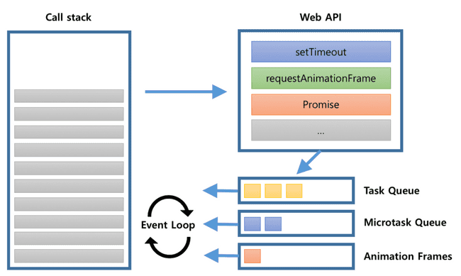

## 자바스크립트의 비동기 처리 과정

### 1. 자바스크립트 엔진

자바스크립트는 기본적으로 싱글 스레드에서 동작한다.  
싱글 스레드라는 말은 하나의 call stack에서 한번에 하나의 task밖에 처리할 수 없다는 말과 같다.  
그래서 비동기를 이용하여 효율적으로 task를 처리한다.  
그렇다면 어떻게 동작하여 효율성을 높이는지 궁금증이 생긴다.

> 자바스크립트 엔진은 코드를 실행하는 일을 하고, 비동기적인 로직들은 모두 Web API에서 처리된다.


이미지 출처: (<https://sculove.github.io/post/javascriptflow/>)

### 2. Event Loop, Queue

Event Loop는 자바스크립트 엔진과 브라우저의 Web API 사이에서 작동하여 task 순서를 제어한다.  
콜 스택이 비어있을 때 큐에서 task를 꺼내 콜 스택에 넣는 역할을 한다.  
자바스크립트는 이 Event Loop와 큐들을 이용하여 비동기 작업을 수행한다.  
직접적인 작업은 Web API에서 처리하고 완료 시 콜백을 큐로 받아서 처리하게 되는데,
여기서 큐에 task가 있는지 매번 검사하여 콜 스택으로 넣어주는 역할을 하는 것이 Event Loop이다.

### 3. 처리 과정

```js
console.log("script start");

setTimeout(function() {
  console.log("setTimeout");
}, 0);

Promise.resolve().then(function() {
  console.log("promise1");
}).then(function() {
  console.log("promise2");
});

requestAnimationFrame(function {
    console.log("requestAnimationFrame");
})

console.log("script end");
```

위와 같은 코드가 있다고 가정을 해보자.

결과는 아래와 같다.

```console
script start
script end
promise1
promise2
requestAnimationFrame
setTimeout
```

#### 순서

1. 첫번째로는 콜 스택에 함수들이 올라갈 것이다.  
2. 스크립트가 실행되고 console.log('script start') 가 처리된다.  
3. 그 다음 setTimeout 함수가 콜 스택에 올라가게 되는데 Web API에게 setTimeout을 요청하고 스택에서 빠진다.
4. Web API는 작업 완료 후 콜백 함수를 task queue에 등록한다.
5. Promise 작업이 콜 스택에 올라오고 Web API에게 Promise 작업을 요청하고 스택에서 빠진다.
6. Web API는 작업 완료 후 콜백 함수를 microtask queue에 등록한다.
7. requestAnimationFrame 작업이 콜 스택에 올라오고 Web API에게 작업을 요청하고 스택에서 빠진다.
8. Web API는 작업 완료 후 콜백 함수를 Animation frames에 등록한다.
9. console.log('script end')가 처리된다.
10. 스크립트 실행이 완료되고 콜 스택이 비워진다.
11. Event Loop가 콜 스택이 비어있음을 감지하고 **가장 먼저 microtask queue**에 등록된 콜백 함수를 콜 스택에 등록한다.
12. 첫번쨰 Promise의 콜백 함수가 실행되어 console.log('promise1') 이 처리된다.
13. 콜 스택에서 첫번째 then 콜백 함수가 빠지고 두번째 then 콜백 함수를 microtask queue에 넣는다.
14. Event Loop가 콜 스택이 비었음을 감지하고 microtask queue에 있는 두번째 then 콜백 함수를 콜 스택에 등록한다.
15. 두번째 콜백 함수의 console.log('promise2')가 처리되고 스택에서 빠진다.
16. Event Loop가 콜 스택이 비었음을 감지하고 **두번째로 animation frames**에 등록된 콜백 함수를 콜 스택에 등록한다.
17. 브라우저는 렌더링 작업을 하여 UI를 업데이트하고 스택에서 빠진다.
18. Event Loop가 콜 스택이 비었음을 감지하고 **마지막으로 task queue**에 등록된 콜백 함수를 콜 스택에 등록한다.
19. setTimeout 함수가 실행되어 console.log('setTimeout')이 처리되고 스택에서 빠진다.

#### ❗️ 기억해야할 것

- 비동기 작업으로 등록되는 작업은 task, microtask, animation frame 작업으로 구분된다.  
- microtask, animationframe 작업 이후에 task 작업이 처리된다.

---

📂 **참고자료**

- <https://velog.io/@titu/JavaScript-Task-Queue%EB%A7%90%EA%B3%A0-%EB%8B%A4%EB%A5%B8-%ED%81%90%EA%B0%80-%EB%8D%94-%EC%9E%88%EB%8B%A4%EA%B3%A0-MicroTask-Queue-Animation-Frames-Render-Queue>
- <https://sculove.github.io/post/javascriptflow/>
