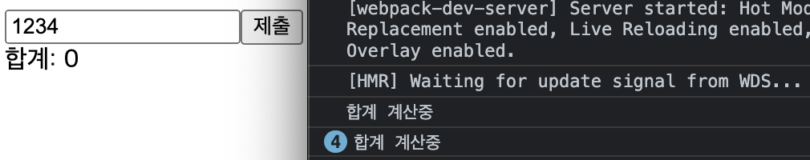

## React Hooks

React Hooks는 React v16.8 기준으로 등장하여 함수형 컴포넌트에서 다양한 기능을 사용할 수 있게 도와준다.

## 1. useState

```bash
  Const [state, setState] = useState(initialState);
  # ① Const [변수, Setter] = useState(초기값);
```

① useState 위와 같은 형태로 선언하여 사용하고 함수형 컴포넌트에서 상태 관리를 할 수 있게 도와준다.

```bash
  function Counter({initialCount}) {
    const [count, setCount] = useState(initialCount);
    return (
      <>
        <div>Count: {count}</div>
        <button onClick={() => setCount(initialCount)}>Reset</button>
        <button onClick={() => setCount(prevCount => prevCount - 1)}>-</button> # ② prevState값 사용
        <button onClick={() => setCount(prevCount => prevCount + 1)}>+</button>
      </>
    );
  }

  return (
    <>
      <div><Counter initialCount={0} /></div> # ③ Props 전달
    </>
  )
```

② prev를 이용하여 이전 state값을 사용할 수 있다.  
③ props를 전달할 때는 위와 같이 element에 값을 할당하여 전달한다.

### ❗️ 결과

  
ㅇ + 버튼 클릭 시 1씩 증가한다.  
ㅇ - 버튼 클릭 시 1씩 감소한다.  
ㅇ Reset 버튼 클릭 시 전달받은 Props 값으로 초기화된다.

---

## 2. useEffect

useEffect는 컴포넌트가 렌더링 될 때마다 특정 작업을 수행하도록 도와준다.

---

## 3. useRef

```bash
const lecture = () => {
  const [number, setNumber] = useState("");
  const inputEl = useRef(null); # ① useRef 선언

  const onChange = e => {
    setNumber(e.target.value);
  }

  const onSubmit = e => {
    setNumber('');
    inputEl.current.focus(); # ② .current를 통해 객체 접근하여 함수 사용
  }

  return (
    <>
      <div>
        # ③ DOM에 ref를 사용하여 해당 element 제어
        <input value={number} onChange={onChange} ref={inputEl}></input>
        <button onClick={onSubmit}>제출</button>
      </div>
    </>
  );
};
```

① 다음과 같이 useRef를 선언하여 사용한다.

> ❗️ 아규먼트로 초기값을 설정할 수 있다. 초기로 설정된 값은 지역 변수 값처럼 사용할 수 있고 렌더링을 일으키지 않기 때문에 렌더링과 관계없는 값을 필요로 할 때 사용한다.

② element를 제어할 때, **변수.current**를 통하여 객체 접근하여 제어할 수 있다.  
③ DOM에 위와 같이 **ref={변수}** 형태로 사용한다.

### ❗️ 결과

  
제출 버튼을 클릭해도 focus가 유지된다.

---

## 4. useMemo

```bash
const getSum = numbers => {
  console.log('합계 계산중');
  if (numbers.length === 0) return 0;
  const sum = numbers.reduce((a, b) => a + b);
  return sum;
}; # ① 합계를 리턴하는 함수

const lecture = () => {
  const [number, setNumber] = useState("");
  const [list, setList] = useState([]);
  const inputEl = useRef(null);

  const onChange = (e) => {
    setNumber(e.target.value);
  };

  const onSubmit = (e) => {
    const nextList = list.concat(parseInt(number));
    setList(nextList);
    setNumber("");
    inputEl.current.focus();
  };

  const sum = () => getSum(list); # ② 함수 호출

  return (
    <>
      <div>
        <input value={number} onChange={onChange} ref={inputEl}></input>
        <button onClick={onSubmit}>제출</button>
        <div>합계: {sum()}</div>
        <ul>
          {list.map((value, index) => (
            <Li key={index} value={value} />
          ))}
        </ul>
      </div>
    </>
  );
```

위와 같이 함수를 작성하고 호출 시, 렌더링이 될 때 마다 함수가 호출된다.

> ❗️ 함수형 컴포넌트는 클래스형과 달리 state의 변화를 감지하여 리렌더링 시, 함수 컴포넌트 자체를 다시 실행하기 때문에 함수가 계속 호출된다.

### ❗️ 결과


위와 같이 값 입력 시 마다 값이 갱신되고, 이는 성능 저하로 이어진다.  
이 문제를 해결해 주는 hooks가 **useMemo**이다.

```bash
 const sum = useMemo(() => getSum(list), [list]);
```

위와 같이 useMemo를 선언하고 호출 함수를 감싸준다.  
두번째 인자로 변화 감지 시 값을 갱신할 요소를 대괄호 안에 넣어준다.  
값을 기억했다가 변화를 감지했을 때 새로운 값을 내어주는 방식이다.  
위의 경우 list의 값 변화를 감지했을 때, 값을 갱신한다.

### ❗️ 결과


위와 같이 list값 갱신 전까지 값을 갱신하지 않는다.

---

## 5. useCallback

```bash
const onChange = useCallback((e) => { # ① useCallback 사용
  setNumber(e.target.value);
}, []);

const onSubmit = useCallback((e) => { # ① useCallback 사용
  const nextList = list.concat(parseInt(number));
  setList(nextList);
  setNumber("");
  inputEl.current.focus();
}, [number, list]);
```

① 위와 같은 형태로 함수에 useCallback을 사용한다.  
useCallback은 useMemo와 동일하게 성능 최적화를 위해 사용한다.  
useCallback을 사용하면 리렌더링 시, 배열에 설정한 값이 변경되기 전까지 함수를 다시 호출하지 않고 재사용한다.  
useCallback은 useMemo를 좀 더 간단하게 함수에 사용하기 위해 사용한다.

> ❗️ useCallback(fn, deps)은 useMemo(() => fn, deps) 와 같다.

---

📂 **참고자료**

- [React 공식 문서](https://ko.reactjs.org/docs/hooks-reference.html)
- [VELOPERT님 글](https://velog.io/@velopert/react-hooks)
