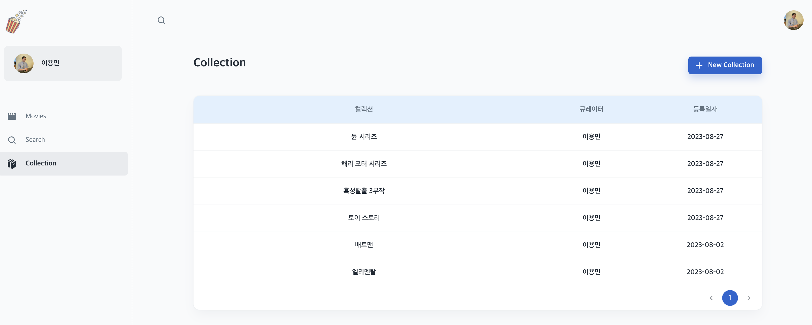
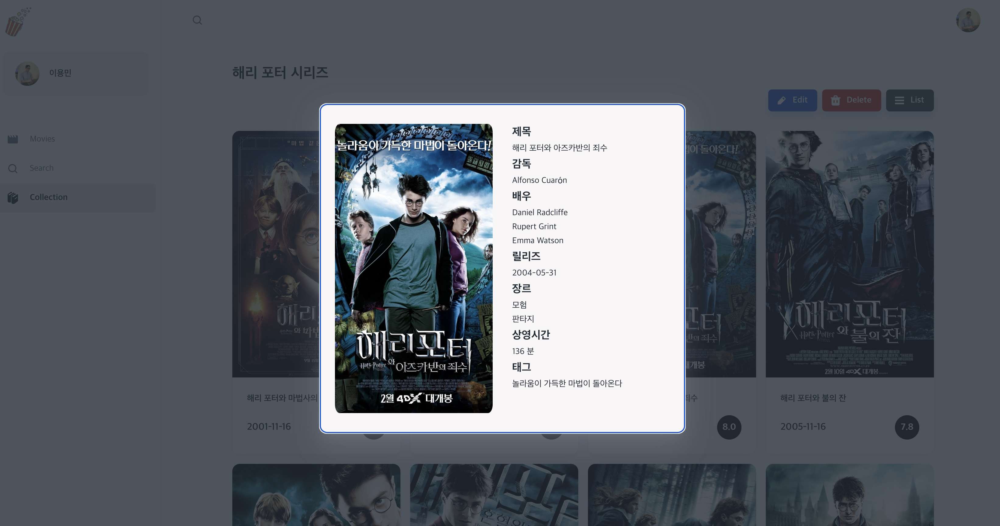
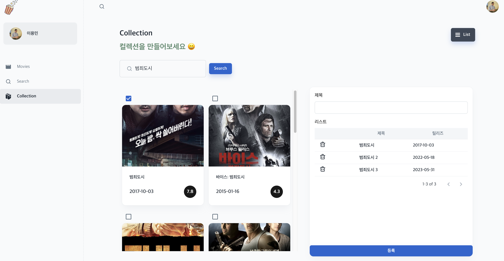
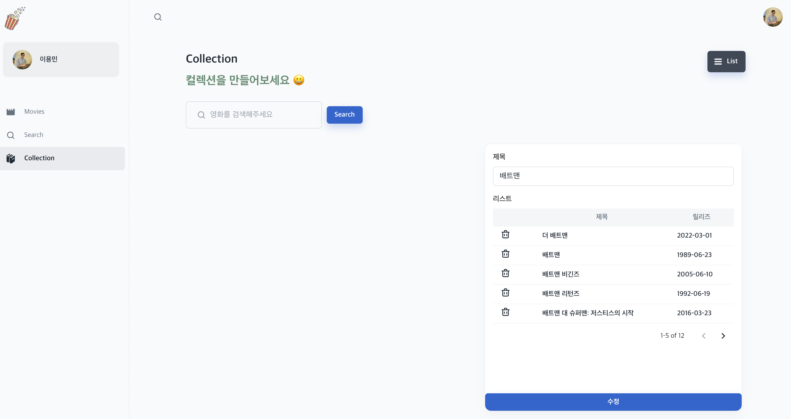
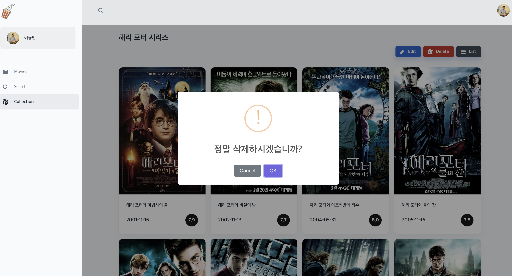

## ✔ 7주차 회고

7주차에는 CRUD를 베이스로 컬렉션 기능을 구현했다.  
기존에 만들어놨던 컴포넌트들을 재활용하여 구현했다.

### 1. Did

#### ① 컬렉션 리스트



- MUI의 테이블 컴포넌트들을 이용하여 구현했다.
- 추가된 컬렉션들을 최신순으로 출력했다.

#### ② 컬렉션 디테일




- 기존에 사용했던 리스트, 디테일 컴포넌트를 재활용하여 디테일 페이지를 구현했다.
- 글의 작성자인지를 검증하여 Edit, Delete 버튼 출력 여부 분기 처리를 했다.

#### ③ 컬렉션 추가



- 기존에 사용했던 검색 컴포넌트와 테이블 컴포넌트를 재활용하여 컬렉션 추가 페이지를 구현했다.
- 체크 박스와 게시판이 연동 되어야 하는 것에서 조금 어려웠지만 전역 state를 통해 해결했다.  

#### ④ 컬렉션 수정



- 추가 기능과는 다르게 기존 데이터를 가져와야했고, 게시판에 들어있는 영화들은 검색 시에 체크박스에 체크가 되어 있어야 했다.
- add 컴포넌트에서 navigate의 state 기능을 이용하여 add와 edit으로 분기 처리하여 구현했다.

#### ⑤ 컬렉션 삭제



- 글 작성자 본인만 삭제가 가능하도록 버튼 출력 조건을 주었다.

#### ⑥ 페이지네이션

한번에 모든 콜렉션 데이터를 가져올 수 없으니, 페이지네이션을 통해 페이지 변경 시 데이터 요청을 하는 방식으로 구현을 했다.  

- Mongoose에서는 skip, limit 함수를 사용하여 페이지네이션을 지원한다.  
- skip: 가져올 index 번호, limit: 항목 갯수

```js
  // 페이지 파라미터
  const page = req.params.page - 1;

  // 페이징 항목 갯수
  const limit = req.query.limit;

  // 번호
  const skip = page * limit;

  const response = await Collection.find()
    .sort({ rgstDate: -1 })
    .skip(skip)
    .limit(limit);
```

위와 같이 콜렉션 데이터를 가져와 렌더링 시켜주는 방식으로 구현했다.

---
