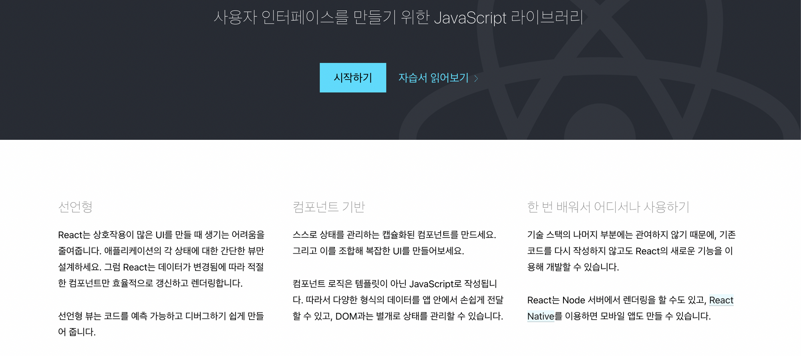

## 원티드 프리온보딩 프론트엔드 인턴십 2주차 회고

화요일 ~ 금요일에 강의 수강, 개인 과제, 팀 과제를 수행하니 꽤나 바빴고 정신없이 흘러갔다.  

1주차에는 새롭게 만난 분들과 협업을 위해 소통하는 법을 배웠었다.  
프로젝트 구조, 컨벤션을 맞춰가는 과정을 배웠고 [ESLint, Prettier](https://slowteady.github.io/work/eslint-prettier/), [Husky](https://slowteady.github.io/work/husky/) 등을 활용하여 [결과물](https://github.com/pre-onboarding-12th-team6/pre-onboarding-12th-1-6)을 냈다.  

2주차에는 1주차 과제 리뷰, 최적화, 의존성, 관심사 분리에 대해 배웠다.

---

### 1. 과제 리뷰

과제 리뷰는 클린 코드 위주로 진행되었다.  
멘토님의 판단과 설득력 있는 근거를 들을 때 마다 머리를 맞은 것 같은 인사이트를 받았다.  

#### 1-1. Single source of truth  

- 불필요하게 state를 퍼뜨려서 사용하지 말고 그대로 사용하자는 말이다.  
- props로 state를 사용할 때, 또 하나의 state를 만들어서 사용하는 것이 아니라, 기능이 같다면 props를 그대로 사용해야한다.
- 불필요한 state가 많아질수록 관리가 어려워지고 버그 발생의 위험성이 증가한다.

```js
const TodoItem = ({ id, isCompleted = false, todo }) => {
  const [isChecked, setIsChecked] = useState(isCompleted);

  const handleCheck: ChangeEventHandler<HTMLInputElement> = () => {
    todoApi.updateTodo(id, todo, !isChecked)
    .then(() => setIsChecked((prev) => !prev));
  };
```

```js
const TodoItem = ({ id, isCompleted, todo }) => {
  const handleCheck: ChangeEventHandler<HTMLInputElement> = () => {
    todoApi.updateTodo(id, todo, !isCompleted)
    .then((newTodo) => setTodo(id, newTodo));
  };
```

> 위와 같이 props를 이용하여 로직을 구현하면 불필요한 state의 파생을 줄일 수 있다.

#### 1-2. 상수값 활용

```js
export const AuthProvider = ({ children }: { children: React.ReactNode }) => {
  const [token, setToken] = useState(localStorage.getItem('access_token'));
                                  .
                                  .
                                  .
  const signin = ({ email, password }: IAuthInfo, callback?: () => void) => {
    return postSignIn({ email, password }).then(({ access_token }) => {
      setToken(access_token);
      localStorage.setItem('access_token', access_token);
      if (callback) callback();
    });
  };

  const value: AuthProviderProps = { token, signin, signup };
  return <authContext.Provider value={value}>{children}</authContext.Provider>;
};
```

```js
const TOKEN_KEY = 'access_token';

export const AuthProvider = ({ children }: { children: React.ReactNode }) => {
  const [token, setToken] = useState(localStorage.getItem(TOKEN_KEY));
                                  .
                                  .
                                  .
  const signin = ({ email, password }: IAuthInfo, callback?: () => void) => {
    return postSignIn({ email, password }).then(({ access_token }) => {
      setToken(access_token);
      localStorage.setItem(TOKEN_KEY, access_token);
      if (callback) callback();
    });
  };

  const value: AuthProviderProps = { token, signin, signup };
  return <authContext.Provider value={value}>{children}</authContext.Provider>;
};
```

> 중복되는 고정값들을 상수로 정의하여 사용하면 관리와 코드 가독성 측면에서 장점을 가질 수 있다.

#### 1-3. 주석

***좋은 주석 vs 나쁜 주석***

- 코드를 설명하는 주석은 나쁜 주석이다.
- 코드로 표현하지 못하는 부분을 주석으로 표현해야 한다.
- 주석으로 이해시키기 이전에 코드로 이해를 시킬 수 있어야한다.

#### 1-4. 선언적 코드

***절차적 코드 vs 선언적 코드***

- 절차적: 과정에 초점을 맞춤
- 선언적: 결과에 초점을 맞춤



리액트는 **선언적** 코드를 지향한다.  
리액트 공식문서를 보면 첫번째 장점으로 **선언형**을 내세우고 있다.

```js
function Sign() {
 const { pathname } = useLocation();
 let page = 'signin';

 if (pathname === routerPaths.signup.path) {
  page = 'signup';
 }

 return <SignForm page={page} />;
}

export default Sign;
```

위 처럼 변수 page에 대한 과정이 보이는 코드를 절차적 코드라고한다.

```js
function Sign() {
 const { pathname } = useLocation();

 const page = pathname === routerPaths.signup.path ? 'signup' : 'signin';

 return <SignForm page={page} />;
}

export default Sign;
```

위 처럼 변수 page에 대한 결과가 보이는 코드를 선언적 코드라고한다.

> 선언적 코드는 의도 표현, 가독성 측면에서 우위를 가진다.  
> let 변수 선언 키워드를 사용하지 않으면 절차적인 코드를 피할 수 있다.

### 2. 최적화

최적화 관련 내용은 정말 알찼다.  
최적화 관련 내용을 [리액트 카테고리의 글](https://slowteady.github.io/react/react-05/)로 따로 작성했다.

### 3. 의존성

#### 3-1. 의존성 배열

리액트에서 의존성 배열은 매우 중요하다.  
제대로 다루지 못한다면 버그의 원인이 되기 때문이다.  

```js
function Component(){
 const [count, setCount] = useState(0);
 
 const effect = () => {
  document.title = `you clikced ${count} times`
 };

 useEffect(effect, [count]];
}
```

- effect 함수는 count에 의존하고 있다.
- count는 effect의 의존성이라고도 표현할 수 있다.

> useEffect의 첫 인자의 함수가 가진 값이 아닌 외부 함수의 요소를 사용한다면, 그 요소는 의존성이된다.

#### 3-2. 의존성 배열의 선정 기준

1. 모든 의존성을 빼먹지 말고 의존성 배열에 명시한다.
2. 가능하다면 의존성을 적게 만들어야한다.

위의 두 원칙을 지키면 의존성 배열을 선정하는 것이 수월해질 것이다.

### 4. 관심사 분리

소프트웨어 개발에 있어 **모듈화** 라는 것은 굉장히 중요하다.  
소프트웨어는 계속해서 변화하기 때문에 유연한 코드 수정을 통해 대응할 수 있어야한다.  
하나의 모듈이 하나의 관심사를 가지고 있다면 이를 유연하게 대응할 수 있다.  
이어서 코드의 재활용성에서도 효율이 좋아지기 때문에 **관심사 분리**는 필수다.

---
