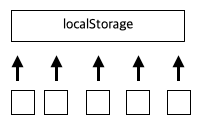
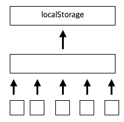

## 원티드 프리온보딩 프론트엔드 인턴십 3주차 회고

3주차에는 코드 리뷰, contextAPI, 의존성, TypeScript에 대해 배웠다.

### 1. 코드 리뷰

#### 1-1. 매직넘버 지양

```ts
const isPromotionSection = (issuesIndex) =>
  issuesIndex > 0 && issuesIndex % 4 === 0;
```

```ts
const AD_EXPOSE_INTERVAL = 4;

const isPromotionSection = (issuesIndex) =>
  issuesIndex > 0 && issuesIndex % AD_EXPOSE_INTERVAL === 0;
```

- 매직 넘버란 코드에서 쓰일 수 있는 특정 숫자를 지칭한다.  
- 코드에서 **4** 와 같은 숫자는 그냥 사용한다면 어떤 의미인지 알기 어렵다.
- 상수로 정의하여 숫자에 대한 의미까지 같이 부여하는 것이 적합하다.

#### 1-2. 관심사 분리, 선언적 개발, 추상화

```ts
export const DetailIssue = () => {
  const { id } = useParams();
  const dateFormat = new Intl.DateTimeFormat("ko", { dateStyle: "long" });

  const [detailIssue, setDetailIssue] = useState(null);
  const [isDetailIssueLoading, setIsDetailIssueLoading] = useState(false);

  useEffect(() => {
    setIsDetailIssueLoading(true);
    getIssuesDetail(id).then(({ data }) => {
      setDetailIssue(data);
      setIsDetailIssueLoading(false);
    });
  }, []);

  if (isDetailIssueLoading) return <Loading />;
  if (!detailIssue)
    return (
      <StyledNotFoundDetailIssue>
        <div>해당 이슈를 찾을 수 없습니다.</div>
      </StyledNotFoundDetailIssue>
    );

  return (
    <StyledDetailIssue>
      <div>
        <div className="thumbnail-content">
          
          <IssueItem
            title={detailIssue.title}
            number={detailIssue.number}
            comments={detailIssue.comments}
            updatedAt={dateFormat.format(new Date(detailIssue.updated_at))}
            userName={detailIssue.user.login}
          />
        </div>
      </div>
      <MarkDown content={detailIssue.body} />
    </StyledDetailIssue>
  );
};
```

```ts
export const DetailIssue = () => {
  const { id } = useParams();
  const dateFormat = new Intl.DateTimeFormat("ko", { dateStyle: "long" });

  // useIssue를 함수로 만들어 분리하여 '데이터를 어떻게 가져오는지' 에 대한 관심사를 분리
  // => input/output만 보여줌으로써 코드를 직관적으로 이해 시킴
  const { issue, isLoading } = useIssue(id);  
  const { title, number, comments, updated_at, user } = issue; // 적절한 구조분해

  if (isLoading) return <Loading />;

  if (!issue)
    return (
      <StyledNotFoundDetailIssue>
        <div>해당 이슈를 찾을 수 없습니다.</div>
      </StyledNotFoundDetailIssue>
    );

  return (
    <StyledDetailIssue>
      <div>
        <div className="thumbnail-content">
          
          <tem
            title={title}
            number={number}
            comments={comments}
            updatedAt={dateFormat.format(new Date(updated_at))}
            userName={user.login}
          />
        </div>
      </div>
      <MarkDown content={issue.body} />
    </StyledDetailIssue>
  );
};

function issueReducer(state, action) {
  switch (action.type) {
    case "requestIssue": {
      return { ...state, isLoading: true };
    }
    case "loadIssue": {
      return { ...state, issue: action.issue, isLoading: false };
    }
  }
}

function useIssue(id) {
  // state를 reducer로 사용하여 행동을 선언적, 직관적으로 표현 
  const [{ issue, isLoading }, dispatch] = useReducer(issueReducer, {
    issue: null,
    isLoading: false,
  });

  useEffect(() => {
    dispatch({ type: "requestIssue" });

    issueService
      .getIssue(id)
      .then((issue) => dispatch({ type: "loadIssue", issue }));
  }, [id, issueService, dispatch]);

  return { issue, isLoading };
}
```

- 추상화라는 것은 문제의 본질만 남기고 부가적인 내용은 없애는 것이다.
- 핵심 내용이 더 두드러지도록 코드를 배치해야한다.
- 코드중복을 줄이고, 핵심 내용이 아닌 코드들은 함수를 이용하여 짧고 직관적으로 표현하는 것이 좋다.

#### 1-3. useEffect를 통한 연쇄 반응 지양

```ts
const useIssueList = (org: string, repo: string) => {
  const [state, dispatch] = useReducer(issueListReducer, {
    issues: [],
    currentPage: 1,
    isLoading: false,
    isInfiniteLoading: false,
    error: "",
  });

  const setNextPage = useCallback(() => {
    dispatch({ type: ACTION_TYPE.NEXT });
  }, [dispatch]);

  let flag = true;

  useEffect(() => {
    dispatch({ type: ACTION_TYPE.INFINITE_LOADING });

    const getIssues = async () => {
      if (state.currentPage === 1) dispatch({ type: ACTION_TYPE.LOADING });
      try {
        const issueList = await getIssueList(org, repo, state.currentPage);
        dispatch({
          type: ACTION_TYPE.SUCCESS,
          payload: { issues: issueList as IssueListItem[] },
        });
      } catch (error) {
        if (axios.isAxiosError(error) || error instanceof Error) {
          dispatch({ type: ACTION_TYPE.ERROR, payload: { error: error } });
        }
      }
    };

    if (flag) {
      flag = false;
      getIssues();
    }
  }, [state.currentPage]);

  return {
    ...state,
    setNextPage,
  };
};
```

- 위의 방식은 useEffect를 통해 연쇄적인 state 변화를 일으키기 때문에 좋지 않다.

```ts
function onClick() {
  setState1();
}
useEffect(() => setState2(), [state1]);
useEffect(() => setState3(), [state2]);

<div onClick={onClick} />
```

- 위의 로직은 div를 클릭한다면 렌더링이 3번된다.
- 연쇄적인 반응을 유발하면 어떤 상태가 될지 예측하기가 어려워진다.
- 이 방식으로 규모가 커져 로직이 복잡해지면 버그를 유발할 수도 있다.

```ts
const useIssueList = (org: string, repo: string) => {
  const [state, dispatch] = useReducer(issueListReducer, {
    issues: [],
    currentPage: 1,
    isLoading: false,
    isInfiniteLoading: false,
    error: "",
  });

  const setNextPage = useCallback(async () => {
    const getIssues = async () => {
      if (state.currentPage === 1) dispatch({ type: ACTION_TYPE.LOADING });

      const nextPage = state.currentPage + 1;

      try {
        const issueList = await getIssueList(org, repo, nextPage);
        dispatch({
          type: ACTION_TYPE.SUCCESS,
          payload: { issues: issueList as IssueListItem[] },
        });
      } catch (error) {
        if (axios.isAxiosError(error) || error instanceof Error) {
          dispatch({ type: ACTION_TYPE.ERROR, payload: { error: error } });
        }
      }
    };

    dispatch({ type: ACTION_TYPE.NEXT });
    dispatch({ type: ACTION_TYPE.INFINITE_LOADING });
    getIssue();
  }, []);

  return {
    ...state,
    setNextPage,
  };
};
```

- state 변화를 한번에 처리하면 어떻게 변화가 되는지 알 수 있다.

> 리액트 공식 문서에서도 연쇄적인 반응을 지양하라고 명시되어있다.  
> (<https://react.dev/learn/you-might-not-need-an-effect#chains-of-computations>)

### 2. ContextAPI

이번 교육 시간을 통해 ContextAPI에 대해 더 자세하게 알게되어서 좋았다.

- ContextAPI는 단지 복잡한 Props Drilling을 해결하기 위한 기술이다.
- State와는 관련이 없다.  
- 많이 사용할 수록 복잡도가 증가하고 state 흐름을 파악하기 어려워지기 때문에 신중하게 생각하고 사용해야한다.

학습한 내용을 바탕으로 4주차 과제에 유용하게 사용하였다.

```ts
export interface ChildrenProps {
  children: React.ReactNode;
}

interface FilterContextType {
  filterIds: string[];
  setFilterIds: React.Dispatch<React.SetStateAction<string[]>>;
}

const FilterContext = createContext<FilterContextType | null>(null);

export const FilterProvider = ({ children }: ChildrenProps) => {
  const [filterIds, setFilterIds] = useState<string[]>([]);

  return <FilterContext.Provider value={{ filterIds, setFilterIds }}>{children}</FilterContext.Provider>;
};

export const useFilter = () => {
  const context = useContext(FilterContext);
  if (!context) {
    throw new Error('Cannot find FilterProvider');
  }
  return context;
};
```

- createContext와 useContext, state를 한 파일에서 선언하여 모듈화를 시킴으로써 하나의 함수만 호출하여 간단하게 사용할 수 있도록 만드는 것이 좋다.

### 3. 의존성

#### 3-1. 의존성 역전 원칙(DIP)

- 의존성은 특정한 모듈이 동작하기 위해 다른 모듈을 필요로 하는 것을 의미한다.
- 의존성 역전 원칙은 **유연성**이라는 키워드를 위한 원칙이다.
- 소스 코드 의존성이 추상에 의존하며 구체에는 의존하지 않는 것을 의미한다.

> ❓ 추상: 과정은 신경쓰지 않고 **해줘야하는 일**과 **결과**에만 신경쓰는 형태 = Input/Output  
> ❓ 구체: 실질적으로 동작을 하기 위해서 수행해야하는 일련의 동작과 흐름

- 구체는 변경될 여지가 굉장히 많다. 따라서 소스가 구체에 의존한다면 수정해야하는 규모가 커지고 빈도가 잦아진다.

```ts
fetch("todos", {
 headers:{
  Authorization:localStorage.getItem("ACCESS_TOKEN");
 }
}
```

위의 코드는 구체에 의존하고 있다.

1. localStorage 라는 구체적인 사항에 의존하고 있다. 이를 사용하는 로직이 많다면 추후에 다른 저장소로 변경하기 까다로워질 수 있다.
2. localStorage는 브라우저에서 제공하는 API 이다. 외부 요소기 때문에 우리에게 제어권이 없다. 따라서 직접적으로 의존하는 것은 좋지 않은 방향이다.



위의 형태에서 localStorage에 대한 변화가 생긴다면 그 하위 요소들에 대해서도 전부 변화를 시켜줘야한다.



하지만 위의 형태로 설계를 한다면 큰 요소 하나만 변화를 시켜주면 그 하위 요소들은 변화를 시켜줄 필요가 없다.

```js
/* 인터페이스를 정의하여 사용하면 추상, 구체를 분리하기 수월해진다.
 TokenRepositoryInterface
   save(token:string):void
   get():string
   remove():void
*/

class LocalTokenRepository {
  #TOKEN_KEY = "ACCESS_TOKEN";

  save(token) {
    localStorage.setItem(this.#TOKEN_KEY, token);
  }

  get() {
    return localStorage.getItem(this.#TOKEN_KEY);
  }

  remove() {
    localStorage.removeItem(this.#TOKEN_KEY);
  }
}

const tokenRepository = new LocalTokenRepository();

fetch("todos", {
 headers:{
  Authorization:tokenRepository.get();
 }
}
```

만약 이 로직에서 localStorage가 sessionStorage로 바뀐다면

```js
class SessionTokenRepository {
  #TOKEN_KEY = "ACCESS_TOKEN";

  save(token) {
    sessionStorage.setItem(this.#TOKEN_KEY, token);
  }

  get() {
    return sessionStorage.getItem(this.#TOKEN_KEY);
  }

  remove() {
    sessionStorage.removeItem(this.#TOKEN_KEY);
  }
} 

const tokenRepository = new SessionTokenRepository();

fetch("todos", {
 headers:{
  Authorization:tokenRepository.get();
 }
}
```

SessionTokenRepository Class가 있다 가정하면, new SessionTokenRepository() 로직만 교체해주면 된다.

> 이처럼 DIP원칙을 적용하면 다양한 변경에 대해서 손쉽게 대응할 수 있다.

#### 3-2. 의존성 주입

```js
class LocalTokenRepository {
  #TOKEN_KEY = "ACCESS_TOKEN";

  save(token) {
    localStorage.setItem(this.#TOKEN_KEY, token);
  }

  get() {
    return localStorage.getItem(this.#TOKEN_KEY);
  }

  remove() {
    localStorage.removeItem(this.#TOKEN_KEY);
  }
}

class HttpClient {
  constructor(baseURL) {
    this.baseURL = baseURL;
    this.tokenRepository = new LocalTokenRepository();
  }

  fetch(url, options = {}) {
    return window.fetch(`${this.baseURL}${url}`, {
      ...options,
      headers: {
        Authorization: this.tokenRepository.get(),
        ...options.headers,
      },
    });
  }
}

const httpClient = new HttpClient(process.env.BASE_URL)
```

```js
class LocalTokenRepository {
  #TOKEN_KEY = "ACCESS_TOKEN";

  save(token) {
    localStorage.setItem(this.#TOKEN_KEY, token);
  }

  get() {
    return localStorage.getItem(this.#TOKEN_KEY);
  }

  remove() {
    localStorage.removeItem(this.#TOKEN_KEY);
  }
}

class SessionTokenRepository {
  #TOKEN_KEY = "ACCESS_TOKEN";

  save(token) {
    sessionStorage.setItem(this.#TOKEN_KEY, token);
  }

  get() {
    return sessionStorage.getItem(this.#TOKEN_KEY);
  }

  remove() {
    sessionStorage.removeItem(this.#TOKEN_KEY);
  }
}

class TestTokenRepository {
  constructor() {
    this.#token = null;
  }

  save(token) {
    this.#token = token;
  }

  get() {
    return this.#token;
  }

  remove() {
    this.#token = null;
  }
}

class HttpClient {
  constructor(baseURL, tokenRepository) {
    this.baseURL = baseURL;
    this.tokenRepository = tokenRepository;
  };

  fetch(url, options = {}) {
    return window.fetch(`${this.baseURL}${url}`, {
      ...options,
      headers: {
        Authorization: this.tokenRepository.get(),
        ...options.headers,
      },
    });
  }
}

// ver1
const localTokenRepository = new LocalTokenRepository();
const httpClient = new HttpClient(process.env.BASE_URL, localTokenRepository);

// ver2
const sessionTokenRepository = new SessionTokenRepository()
const httpClient = new HttpClient(process.env.BASE_URL, sessionTokenRepository);

// ver3
const testTokenRepository = new TestTokenRepository()
const httpClient = new HttpClient(process.env.BASE_URL, testTokenRepository);
```

- 의존성 주입이란 필요한 의존성을 사용하는 쪽에서 주입해주는 것을 의미한다.
- 위의 코드처럼 사용하는 모듈에 따른 Repository Class가 여러개가 만들어져 있다면, 사용하는 쪽에서는 간단하게 인스턴스를 생성하여 의존성을 주입하여 사용할 수 있다.
- 간단하게 말하면, 함수에 인자를 전달하는 것과 같은 의미이다.
- React에서는 props 전달도 의존성 주입이다.

---
