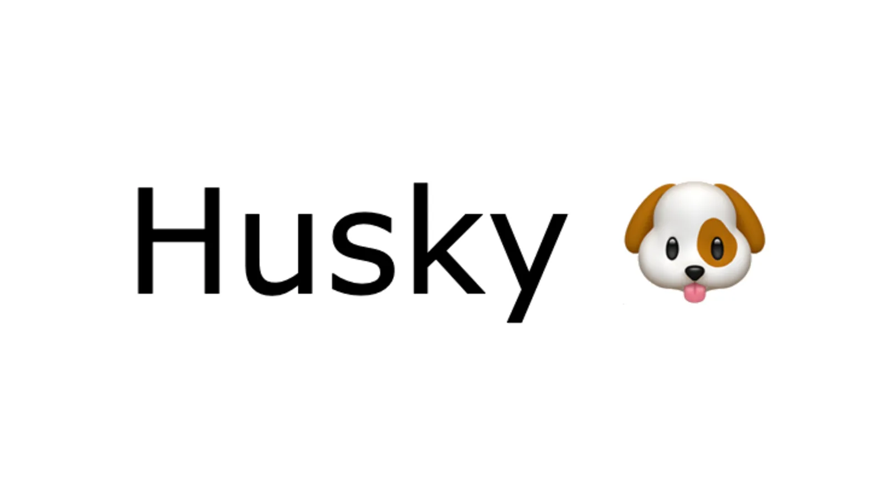

## ✔ 협업을 위한 Husky


이미지 출처: (<https://dev.to/maithanhdanh/configuration-for-husky-pre-commit-1fo5>)

### 1. Husky

- ESLint와 Prettier를 도입해도 사용자가 적용하지 않으면 문제가 생긴다.  
- 따라서 자동화를 통해 강제성을 부여할 필요성이 생긴다.
- Git Hooks를 통해 Git 이벤트가 발생될 때 스크립트를 실행하여 자동화를 할 수 있다.

> **[Husky](https://typicode.github.io/husky/#/?id=articles)는 Git Hooks를 쉽게 설정하고 관리할 수 있게 도와준다.**

### 2. Husky를 통한 Git hooks 적용

#### 2-1. Husky 설치

```bash
npm install husky --save-dev

npx husky install # 최초 설치자만 실행, Husky에 등록된 hook을 .git에 적용시키기 위함

```

#### 2-2. 스크립트 추가

- 꼭 postinstall 프로퍼티로 사용해야한다.
- 이후에 clone 받아서 사용하는 사람이 npm install을 통해 husky install까지 한번에 설치하기 위해 설정한다.

```json
// package.json

{
  "scripts": {
    "postinstall": "husky install",
    "format": "prettier --cache --write .",
    "lint": "eslint --cache .",
  },
}
```

- --cache 옵션은 한번 검증한 파일을 변화가 없다면 다시 검증하지 않기 위해 캐싱을 하게 하는 옵션이다.

#### 2-3. pre-commit, pre-push 설정

- npx husky add .husky/pre-commit "npm run format && git add ." 실행
- npx husky add .husky/pre-push "npm run lint" 실행

### 3. 추가 참고사항

위와 같이 설정을 하면 eslint 에러가 발견되었을 때 실행중인 스크립트가 종료된다.  
따라서 ESLint의 rule에 error, warn 중 어떤 것으로 설정할 지 고려해야한다.  

> eslint에 추가적인 스크립트를 주지 않는다면 일반적으로 error 발견시에만 스크립트가 종료된다.  
> 하지만 스크립트를 "eslint --cache --max-warnings=0" 로 설정한다면 warn 조차 허용되지 않는다.

---

📂 **참고자료**  
