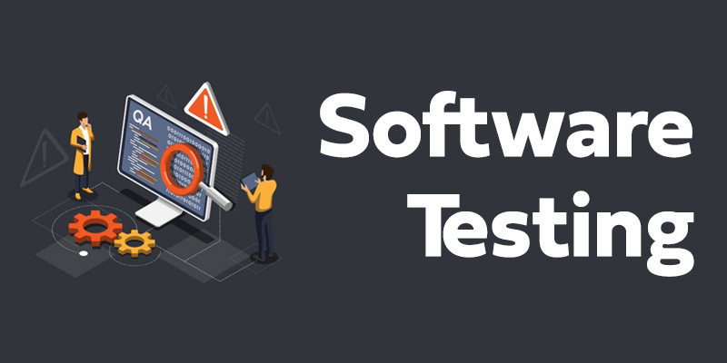

## 소프트웨어 테스트와 TDD

이미지 출처: (<https://www.fitaacademy.in/blog/why-do-we-need-software-testing/>)

---

### 1. 소프트웨어 테스트

소프트웨어 테스트라는 것은 소프트웨어가 정상적으로 동작하는지 확인하는 것을 의미한다.  
이전에는 개발자는 개발만하고 테스팅 과정에는 큰 관여를 하지 않았지만, 최근에는 개발자가 자동화 할 수 있는 소프트웨어 테스트를 구현하고 실행하는 것이 보편화 되어가고 있다.

코드를 통해 테스트를 자동화한다면 이점이 생긴다.

1. 사람이 실행하는 것 보다 빠르다.
2. 정해진 스크립트에 의해 일관성있게 동작하기 때문에 휴먼 에러를 기피할 수 있다.
3. 피드백을 빠른 주기로 개발중에 받을 수 있다.

> 따라서, 소프트웨어 테스트를 통한 테스트의 자동화는 개발자의 생산성을 향상시킬 수 있다.

### 1-1. Unit Test

- 유닛 테스트는 테스트중에 가장 Low Level이고 가장 작은 범위를 테스트한다.
- 개별 함수, 메서드, 클래스, 컴포넌트 등의 동작을 테스트한다.
- 가장 간단한 형태의 테스트로 실행하기 때문에 가장 적은 비용이 든다.

### 1-2. Integration Test

- 통합 테스트는 두개 이상의 모듈이 결합해서 동작을 잘 수행하는지를 테스트한다. 예를 들어, 어떤 컴포넌트가 Redux 같은 라이브러리와 통합 했을 때, 두 묘듈이 상호작용하여 의도한 결과를 도출하는지 테스트 하는 것이다.
- 여러 모듈들을 통합하는 과정이 필요하기 때문에 유닛 테스트보다는 많은 비용이 든다.

### 1-3. End-To-End Test(E2E Test)

- E2E 테스트는 실제 유저가 사용하는 것 처럼 환경을 구축하고 실제 유저의 동작을 흉내내서 테스트한다.
- 실제 환경을 구축하는 것, 시나리오를 설계해야하는 것 등의 이유로 가장 많은 비용이 드는 테스트다.

### 2. TDD

TDD는 Test-Driven-Development의 약어이고 소프트웨어를 개발하는 방법론 중의 하나이다.  
TDD의 핵심은 본 개발 전에 테스트 코드를 먼저 작성하는 것이다.

> 따라서, TDD는 실제 코드를 작성하기 전에 테스트 코드를 먼저 작성한다.

### 2-1. 단계

1. Red: 테스트를 실패하는 테스트 코드를 먼저 작성한다. 실제 코드가 작성되지 않았기 때문에 테스트는 실패할 수 밖에 없다.
2. Green: 테스트를 통과하기 위한 가장 간단한 형태의 실제 코드를 작성한다. 실제 코드를 구현하고 테스트를 돌려 통과해야한다.
3. Blue: Green 단계의 코드를 더 나은 형태로 리팩토링한다. 이 과정을 진행하면서 반복적으로 테스트를 돌려 테스트를 통과해야한다.

### 2-2. 이점

TDD를 적용하여 개발을 하게 되면 이점을 얻을 수 있다.

#### 1. 코드 작성 과정에서 확신을 얻을 수 있다

- 테스트가 작성되어 있고 실시간으로 피드백을 지속적으로 받기 때문에 코드에 기능 이상이 없을 것이라는 확신을 얻을 수 있다.

#### 2. 디버깅 소요 시간을 단축할 수 있다

- 기능에 이상이 생기면 어느 지점부터 잘못되었는지 전체 개발 과정을 돌아봐야하는 경우가 자주 발생하는데, 테스트 코드가 준비된 상황에서 개발을 하게 되면 어느 지점에서 동작이 잘못되고 있는지 빠르게 알아낼 수 있다.

#### 3. 코드의 동작이 명확해진다

- 어떻게 코드를 짜야할 지가 아닌 무슨 코드를 짜야할 지 부터 고민하게 된다.
- 테스트 코드를 작성해야하기 때문에 코드가 해야하는 동작과 어떤 인터페이스가 갖춰줘야 하는 지 생각하게 되므로 자연스럽게 코드의 동작과 관심사를 분리시킬 수 있다.

---
